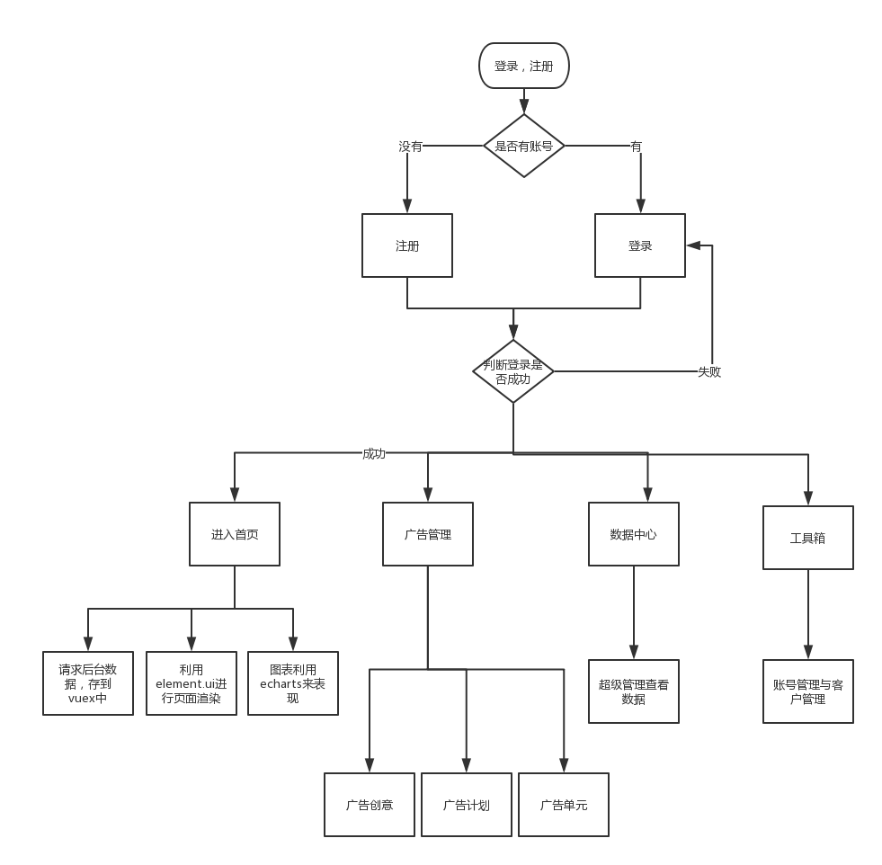

# manage

> A Vue.js project

## Build Setup

``` bash
# install dependencies
npm install

# serve with hot reload at localhost:8080
npm run dev

# build for production with minification
npm run build

# build for production and view the bundle analyzer report
npm run build --report
```


# 智能业务投放系统总结
## 1.整体技术选型（包括脚手架和框架 ES6 Less等）

    Vue2.0+vue-cli+Vuex+Axios+NodeJs+Express+es6
    (1):考虑到团队中的成员对各个框架的熟练程度，还有Vue简单易上手,所以选用Vue;
    (2):Vue-cli:成熟的vue项目架构设计
                提供了本地测试服务器
                集成打包上线方案
    (3):Vuex:vuex借鉴了flux、redux的设计思想，将应用的状态和组件内状态进行了区分，
             将应用的公共状态汇聚到了一处统一管理，避免了组件之间的状态传递。使的复杂应用的状态变更更加清晰
    (4):Axios:简单易用，api接近于jquery，比原生的fetch之类的简单
              浏览器兼容性好，都能兼容IE7，使用fetch就得自己处理兼容
              通用性好，能在node和浏览器中使用，api一致
              稳定大牌，vue官网文档有推荐
    (5):NodeJS:采用事件驱动、异步编程，为网络服务而设计。
               非阻塞I/O
               轻量、可伸缩，适于实时数据交互应用
               单进程，单线程
    (6):Express:历史更久，文档更完整，资料更多，深入人心
    (7):es6:let可以声明块级变量
        箭头函数，箭头函数与包围它的代码共享同一个this
        import模块，除了基本语法外，开发者还可以在一个模块中多次export以及import整个模块作为一个特定的命名空间
        优化了“尾调用（Tail Calls）”：一直到ES5，函数递归调用过多会导致栈溢出（到达内存上限），
        这是因为函数每次调用自己时都会调用一个新版本。但优化之后，每次调用会同上次调用共享同一个上下文，
        保证了内存使用率的稳定。


## 2.路由搭建，路由拦截的实现，权限接口设置

    (1):引入vue中的vue-router来搭建路由;
    (2):利用vue的导航守卫来做路由拦截;
        判断本地存储有没有token字段，有token字段就进入首页，没有就去登录页面进行登录;
        登录成功给本地浏览器存储token字;
    (3):针对登录时传给后端的信息返回相应的字段

## 3.数据请求以及如何封装全局请求接口

    (1):利用axios请求数据
    (2):封装axios
        使用自定义配置创建一个新的axios实例
        指定将应用于每个请求的配置默认值,自定义实例的默认值，（axios.defaults.baseUrl='http://localhost:9000'）
        请求拦截器，响应拦截器

## 4.项目中的核心功能和难点功能介绍

    (1):登录拦截    
        登录拦截对用户名输入框和密码输入框进行验证
        点击登录把用户名和密码通过post方式传入后台,后台与数据做比较，成功或失败返回不同的信息
        登录成功时把登录名存到localStroage和store中,在首页中对用户名进行渲染
        登录拦截时在全局钩子函数中拿到本地存储中的用户名时才能进入写一个路由
    (2):根据时间来改变echarts数据
        利用element.ui渲染首页,通过对日期组件返回的数据进行处理，拿到月份，只要月份改变就改变数据
    (3):封装点击添加创意
        点击添加创意时发送一个自定义事件给父级组件，父级组件对数据进行添加，子组件对数据进行遍历渲染
        点击上传图片，利用element.ui组件来上传，改变上传地址，上传到后台
    (4):上传创意
        点击上传收集页面数据，传入后台

## 5.数据管理(store 是如何管理和维护数据的)
    
    vuex作为插件，管理和维护整个项目的组件状态
    state:数据保存到state中，state数据智能读取，不能改变
    action:处理异步操作，组件内部通过this.$store.dispatch触发
    mutation:改变store中的数据使用mutation,组建内部通过this.$store.cimmit来执行mutation
    涉及数据改变用mutation,涉及业务逻辑的使用actions


## 6.遇到的困难以及解决方式(自定义组件)
    
    困难:在处理element.ui日期组件的值时走了一些弯路
    解决方式:由于使用ui库，所以对组件的原理不熟悉,对日期的处理就耗费了很长时间，最后决定自己封装组件来获取日期，
    这样处理起来也比较顺利

For a detailed explanation on how things work, check out the [guide](http://vuejs-templates.github.io/webpack/) and [docs for vue-loader](http://vuejs.github.io/vue-loader).
